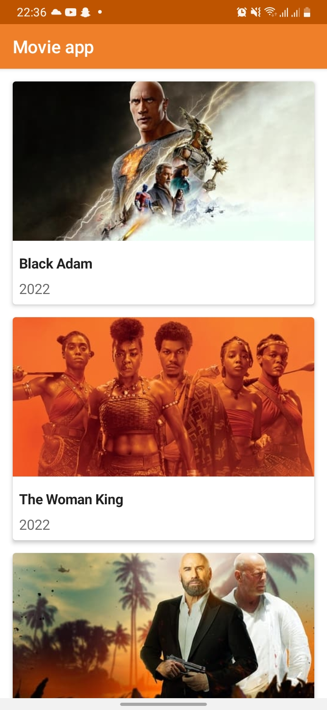
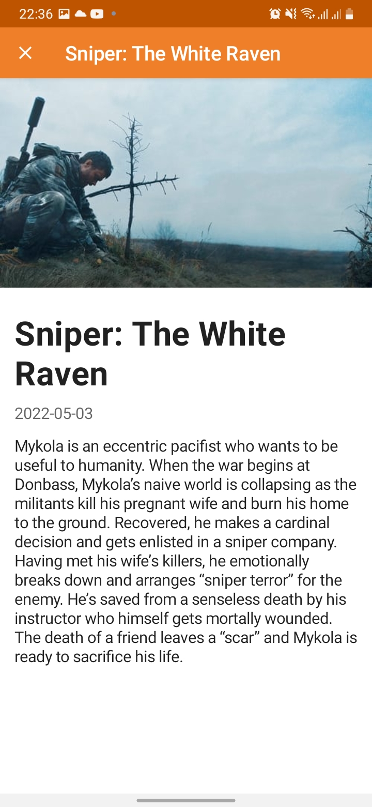
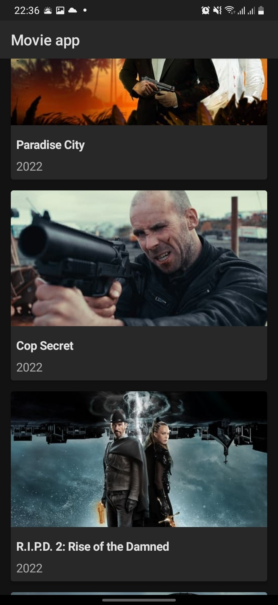
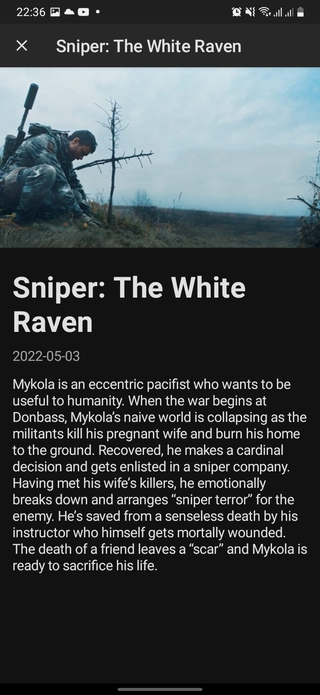

# MoviesApp
<b>Movies App Yassir job application test</b>

Simple Android movies application for Yassir job application using:
<ul>
  <li>Kotlin</li>
  <li>Jetpack Compose</li>
  <li>MVVM Architectural pattern</li>
</ul> 
Major libs used: 
<ul>
  <li>Jetpack Compose</li>
  <li>Hilt</li>
  <li>Retrofit</li>
  <li>Coil</li>
</ul> 

<b>Screenshots</b>

  
  
  
  

